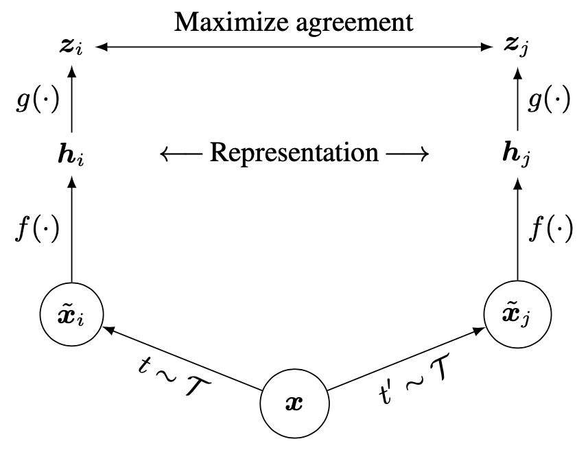
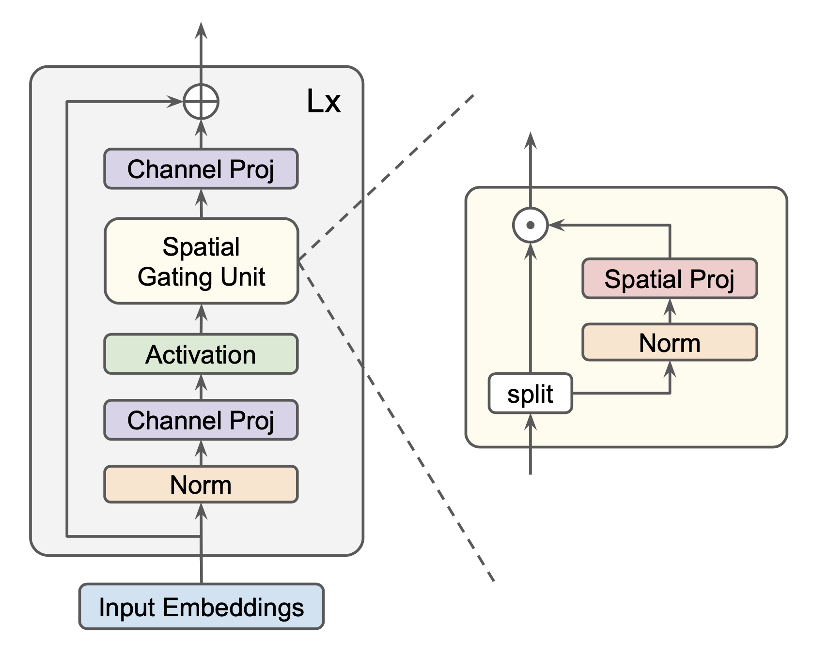

This code is inspired by the papers titled "A Simple Framework for Contrastive Learning of Visual Representations" (https://arxiv.org/abs/2002.05709) and "Pay Attention to MLPs" (https://arxiv.org/abs/2105.08050).

Instead of using ResNet as the backbone, I have used several layers of gMLP and the entire network is trained using "CIFAR-10" dataset.

Fig.1 - SimCLR Architecture

Fig.2 - gMLP Architecture

